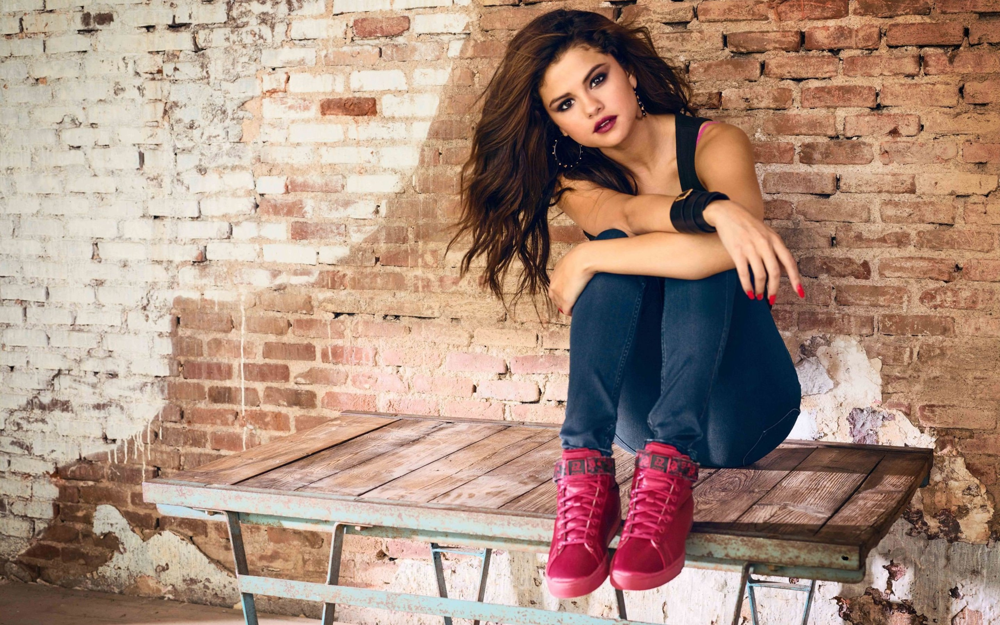
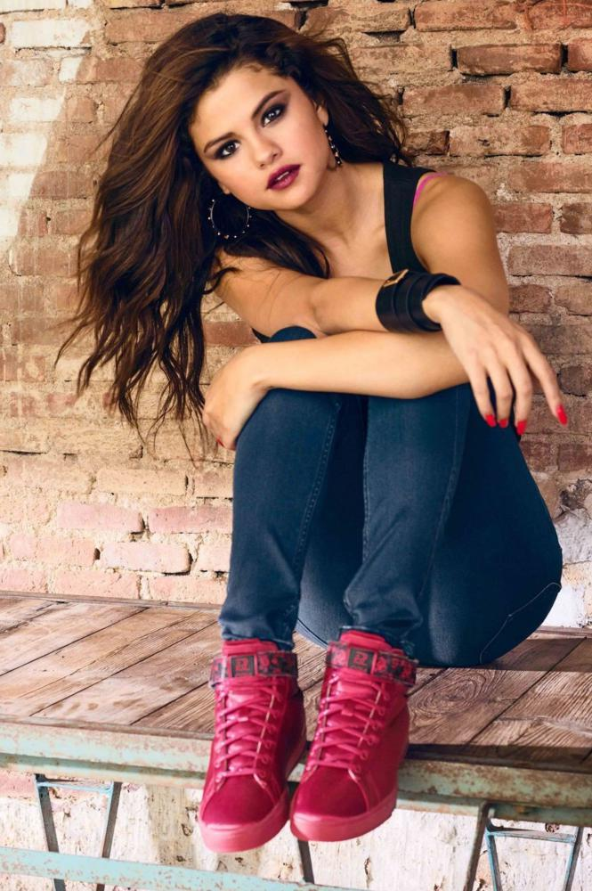

# Intelligent-Cropping-of-Images
Cropping the larger resolution images to the banner size using object detection deep learning models

Dependencies
pip3 install https://github.com/OlafenwaMoses/ImageAI/releases/download/2.0.2/imageai-2.0.2-py3-none-any.whl
wget https://github.com/OlafenwaMoses/ImageAI/releases/download/1.0/resnet50_coco_best_v2.0.1.h5

<b>How to use:</b>
To Run the file:
Python intelligentCrop.py input_image_path output_image_path

ouput:
input image:

Output Image

